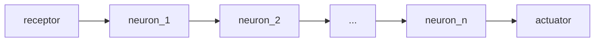

# Немного теории

## Перцептрон

Человеческий мозг представляет собой множество специализированных клеток - __нейронов__ - связанных между собой (эти связи называются __аксонами__). Входные сигналы поступают в мозг от __рецепторов__, обрабатываются нейронами и результат передаётся __актуаторам__.

В упрощенном виде нервную систему человек можно записать следующим образом:

Математическая модель восприятия информации мозгом называется __перцептроном__.

## Марковские цепи

## Простая нейронная сеть

При условии, что входные данные представляют собой вектор $X$, корректное рекуррентное представление слоев имеет вид:

$$R_i = \gamma_i(R_{i-1} \cdot A_i + B_i)$$
$$R_0 = X$$

Где:

* $X = \{x_j, j = 1 \dots k\}$ — вектор входных данных.
* $A_i$ — матрица весов слоя $i$ (умножение производится справа).
* $B_i$ — вектор смещения (bias) слоя $i$.
* $\gamma_i$ — поэлементная функция активации.

Полная сеть описывается как композиция функций:
$$Y = \gamma_n(\dots\gamma_2(\gamma_1(X \cdot A_1 + B_1) \cdot A_2 + B_2)\dots \cdot A_n + B_n)$$
